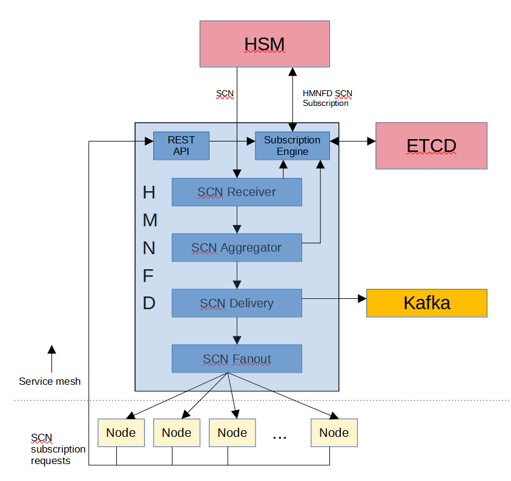

# Cray State Change Notification Service (hmnfd)

The Shasta State Change Notification (SCN) fanout service provides the ability
to notify subscribers of component hardware state changes and other changes
made to and by the Hardware State Manager.  _hmnfd_ is a companion service
to the Hardware State Manager in that it does the heavy lifting of 
distributing state changes and managing subscriptions.

This service uses a RESTful interface to provide the following functions:

* Subscription for component state changes:
  * Hardware state (On, Off, Ready, etc.)
  * Logical state (arbitrary, e.g., AdminDown)
  * Role (Compute, NCN, etc.)
  * Enabled state
  * Flag (OK, Alert, Warning, etc.)
* Ability to view current subscriptions
* Ability to delete subscriptions
* Ability to get and modify current service operating parameters
* Ability to receive State Change Notifications from the Hardware State Manager

_hmnfd_ typically runs on a Kubernetes cluster as one or more Docker container 
instances managed by Kubernetes.  It can also be run from a command shell 
for testing purposes.

## Theory Of Operation



### API Layer

The API layer does all of the API endpoint routing to the HTTP receiver
functions.

### Subscription Handling

Subscriptions are made via the API, and then stored as ETCD key/values.
The key is encoded to contain the subscription information, and the 
stored value for that key contains the URL to send the subscription to
and the nodes being watched.

Compute nodes, NCNs, etc. can generate SCN subscriptions.  In theory, 
any running OS image can subscribe to SCNs as long as they can be 
delivered by HMNFD (must be on the correct networks/VLANs).

Subscriptions will contain a list of components to watch for specified
state changes.  Note that this list can contain the words "all" or
"allnodes".  This greatly simplifies and speeds up subscription matching
if the subscriber can tolerate it.

In addition to nodes doing SCN subscriptions, HMNFD itself will subscribe
for all possible SCNs from HSM.

#### Pruning

The API provides means to generate SCN subscriptions as well as delete
them.  In addition, if HMNFD sees that a given node or component has
"gone away" (e.g. receiving an SCN for a component stating it is now "OFF"),
then HMNFD will prune all of that node's subscriptions.

Also, if an SCN comes in and is to be delivered to a node, and that node
gets errors indicating it no longer exists, its subscriptions will
also be pruned.

### SCN Reception And Fanout

HSM generates all SCNs.  All SCNs are sent to HMNFD via round-robin 
distribution to the multiple running HMNFD instances.  

Once an SCN is received by HMNFD, it will consult ETCD to get subscription
records.  Once these are retrieved (in bulk for speed), they are matched
against the SCN parameters to determine which nodes need to receive the
SCN.

The contents of the SCN are also examined to look for any subscribers that
are no longer alive, and if any are found, those subscriptions are removed.

The SCN is then sent to all matching subscribers using a goroutine worker
pool to help parallelize things.

When sending SCNs to subscribers, multiple attempts are made on failure,
using a back-off algorithm for best results.  As stated earlier, if
an SCN cannot be delivered after all retries are exhausted, SCN will
delete that subscriber's subscription record and no further SCN delivery
attempts will be made.

#### SCN Batching

To minimize SCN traffic, HMNFD will batch up the target subscribers
in SCNs that match all other subscription parameters.  Thus, rather
than sending an SCN to all subscribers for each one that is received
from HSM, fewer SCNs with larger component lists will be sent.

SCNs are batched for a maximum length of time, or maximum component
count, whichever is less.  Once a batched SCN is ready to send, it
is sent to all subscribers.

This greatly cuts down on the number of messages sent, since most SCNs
happen during batch node power-ups and boot operations, which tend
to send lots of identical SCNs for many components in large bursts.
Batching reduces the SCNs sent to one (or very few) per burst rather
than one per individual SCN.

### SCN Distribution To The SMA Framework

When SCNs are received  by HMNFD, they are placed on the SMA Kafka bus
and end up in the SMA database.  This allows for visualization tools 
like Grafana/Kibana/etc. to view component state changes over time.

### Health, Liveness, and Readiness

HMNFD has health, liveness, and readiness APIs which are used by Kubernetes
to determine the fitness of HMNFD.  Various things are checked, such as
ETCD connectivity, etc. to determine fitness and health.

## hmnfd API

_hmnfd_'s RESTful API is described and specified in this repo's 
api/swagger_v2.yaml.  Refer to that file for details.

## hmnfd Command Line

```
Usage: hmnfd [options]

  --debug=num             Debug level (Default: 0)
  --kv_url=num            Key-value service base URL. (Default: "mem:")
	KV_URL_BASE)
  --help                  Help text.
  --nosm                  Don't contact State Manager (for debugging).
  --port=num              HTTPS port to listen on. (Default: 28600)
	URL_PORT)
  --scn_backoff=num       Seconds between SCN send retries (Default: 1)
  --scn_retries=num       Number of times to retry sending SCNs (Default: 5)
  --sm_retries=num        Number of times to retry on State Manager error. 
                              (Default: 3)
  --sm_timeout=num        Seconds to wait on State Manager accesses. 
                              (Default: 3)
  --sm_url=url            State Manager base URL. 
                              (Default: https://localhost:27999/hsm/v2)
  --telemetry_host=h:p:t  Hostname:port:topic  of telemetry service.
  --use_telemetry         Inject notifications onto telemetry bus (Default: no)

```

## Building And Executing hmnfd

### Building hmnfd

#### Building Docker Image

The simplest way to do this is to be in the top-level directory of the HMNFD
repo, then run:

```
$ make image
```

This will build a Docker container image tagged with the current version
(e.g. cray-hmnfd:1.13.0)

#### Building An HMNFD binary

```
$ cd cmd/hms-hmnfd
$ go build -mod=vendor -o hmnfd
```

This produces an 'hmnfd' binary in the same directory.

### Running hmnfd Locally

Starting _hmnfd_:

```
./hmnfd --sm_url=https://localhost:27999/hsm/smd/v1 --port=28501 --use_telemetry=no --kv_url="mem:"
```

### Running hmnfd In A Docker Container

Build the docker container image as shown above.

Then run (add `-d` to the arguments list of `docker run` to run in detached/background mode):

```
docker run -p 28500:28500 --name hmnfd cray-hmnfd:1.13.0
```

### hmnfd CT Testing

In addition to the service itself, this repository builds and publishes cray-hmnfd-test images
containing tests that verify HMNFD on live Shasta systems. The tests are invoked via helm test
as part of the Continuous Test (CT) framework during CSM installs and upgrades. The version of
the cray-hmnfd-test image (vX.Y.Z) should match the version of the cray-hmnfd image being
tested, both of which are specified in the helm chart for the service.

## Potential Future Features And Updates

* Performance/scaling optimizations
  * SCN fanout algorithm changes to spread the fanout load more evenly
  * Potential K/V query optimizations

